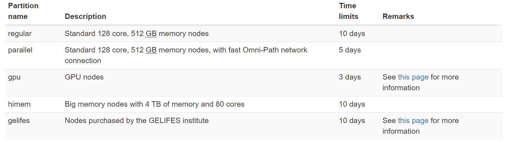

# Notes Week 1 (Habrok Cluster)

---

### Hábrók Cluster

#### connecting:

    ssh username@login1.hb.hpc.rug.nl

*or* 

    ssh -X username@interactive1.hb.hpc.rug.nl

#### Nodes:

**Standard login nodes:**

    login1.hb.hpc.rug.nl, login2.hb.hpc.rug.nl
    
You can use these to connect to the system, copy your files, submit jobs, compile your code, et cetera. You should not use it to test your applications.

**Interactive:**

    interactive1.hb.hpc.rug.nl, interactive2.hb.hpc.rug.nl.
    
The interactive nodes are about half the size of a default compute node, and they allow for a bit more testing. If you just want to run your program for a couple of minutes, these are the machines to use. Do keep in mind that these are also a shared machines and other people may also want to do some testing. So, if you need to do longer and/or more intensive tests, these tasks should be submitted as jobs.

To prevent a single user from using all capacity CPU and memory limits are in place.

**GPU Nodes:**

    gpu1.hpc.rug.nl, gpu2.hpc.rug.nl

These login nodes are equipped with a GPU. You can use them to develop and test your GPU applications.

These machines have an NVIDIA V100 GPU each, which can be shared by multiple users. The tool nvidia-smi will show if the GPU is in use.

Please keep in mind that this is also a shared machine, and more users want to use the GPU in this machine. So, allow everyone to make use of these GPUs and do not perform long runs here. Long runs should be submitted as jobs to scheduler.

#### Setup SSH
ssh-keygen -t ed25519 -f ~/.ssh/id_ed25519

    scp .ssh/id_ed25519.pub p12345@login1.hb.hpc.rug.nl:desktop_key.pub
    mkdir .ssh
    chmod go-rwx .ssh
    cat desktop_key.pub >> .ssh/authorized_keys
    chmod go-w .ssh/authorized_keys

#### Modules

    module

The command module allows for finding and loading software into the environment. For this the command has to be used together with a subcommand to specify the action we want to perform.

The subcommands are:

    avail - for showing a list of available software
    load or add - for loading software into the environment
    list - for showing the currently loaded modules
    unload or del - for unloading a module from the environment
    purge - for unloading all loaded modules from the environment
    save - for saving a set of loaded modules into a configuration for restoring at a later time
    restore for restoring - a saved set of modules
    spider *module* - module lookup

#### Storage areas

    hbquota

To see how much space you have available at the different file systems, the hbquota tool can be used.

    /scratch

Each user of the system also has a directory in /scratch, which is meant for storing large amounts of data that needs to be processed. Please be aware that backups of this data are not made, and that /scratch is not meant for long term data storage. This means that you have to copy important data to other storage yourself. This storage can for example be the /projects or RDMS storage system.

The best way of handling data sets with many (> 10,000) files is to not store them on /scratch as is, but as (compressed) archive files. These files can then be extracted to the fast local storage on the compute nodes at the beginning of a job.

    /projects

On the login/interactive nodes each user will have storage space in /projects/$USER. This storage area is meant for storing data for a longer period. It cannot be reached by the compute nodes as it is not optimized for processing data.

By default 250GB is allocated. This space can be increase upon request, based on a “fair use” principle. Above a certain threshold payment for the space will be required.

    $TMPDIR (local disk)

Each node of the cluster has an amount of fast internal disk space. Most of this space is mounted under a job-specific path that can be reached using the $TMPDIR environment variable. This space is only available for running jobs. For each job a temporary directory is created on this disk space. To prevent people from storing data permanently these directories are removed automatically after the jobs is finished. This means that you have to copy away important data from this location at the end of your job script.

Note that the disk space in $TMPDIR is not shared between the nodes. You cannot access the files on one machine from another, without copying them explicitly over the network.

Copy files to the temporary directory:

    cp mydirectory/* $TMPDIR

An example of a full job script:

    module purge
    module load MYPROGRAM/1.0
    cp -r mydataset/* $TMPDIR
    cd $TMPDIR
    myprogram -i inputdata -o outputdata
    cp -r outputdata /scratch/$USER/mydataset/

#### Transferring Data

Using MobaXterm SSH client

or

    scp [options] [user@host1:]source [user@host2:]destination

example: 

    scp .ssh/id_ed25519.pub p12345@login1.hb.hpc.rug.nl:desktop_key.pub

    rsync -avzp data s3515249@login1.hb.hpc.rug.nl:masterThesis
    rsync -avzp training_simple_policy/ s3515249@gpu1.hpc.rug.nl:masterThesis
or 

    rsync [options] source destination

(best option to not lose files to connection issues)

#### Resource Allocation: Jobs

For each job a user has to specify what amount of resources are required for the job to run properly. The following resources can be requested:

- A number CPU cores per node
- A number of nodes/computers
- An amount of memory per core or node
- The amount of time the job needs
- Special hardware classes/partitions
- Special features like GPUs

**Important guidelines:**
Guidelines for CPU cores, time and memory
The only (easy) way to find out how much time and memory a run needs is to get these numbers from practice. If you have done similar calculations on your desktop or laptop, you may have some idea how long a run takes. You may also have obtained some idea about memory usage by looking at a task manager.

For the first runs you can then use overestimates for the time and memory requirement to make sure your calculations will not be aborted. Once you have gotten feedback from the scheduler about the actual time and memory consumption you can then use more precise amounts. Some hints about reasonable sizes:

- The memory on a standard Hábrók node is at least 4GB per core. So memory requests around 4GB are no problem at all.
- For memory requests above 4GB/core you should check the job output for the actual memory usage and adjust the number for consecutive runs. VERY IMPORTANT Please don't request more than 10GB/core when you are not sure that your program needs it! You are wasting valuable resources others may need if you do.
- VERY IMPORTANT Never request more than 1 CPU core if you don't know that your program can actually use multiple cores. Check the program documentation for information on this.
- IMPORTANT When requesting multiple cores check the actual speed gain with respect to runs using fewer cores. Most programs will not scale beyond a certain number of CPU cores or nodes. Runs may not be faster, and again you will just be wasting resources for no increase in time to result. On the other hand you will experience longer waiting times for your jobs.
- A reasonable time requirement will mainly improve the scheduler performance. Shorter jobs can be more easily scheduled. You will therefore benefit yourself if you don't request long times if you don't need them. There are also limits on the number of very long jobs that are allowed to run in the system simultaneously.
- Smaller (CPU cores & memory) and shorter jobs can be more easily scheduled as fewer resources need to be freed up for them. They may even be squeezed in before large jobs that are waiting for resources to become available. So it is beneficial to use precise job requirements. But balance this with the fact that running out of memory or time will kill your job.

**SLURM Syntax:**

Job scripts should follow SLURM syntax.

**Job Scripts:**

In order to run a job on the cluster, a job script should be constructed first. This script contains the commands that you want to run. It also contains special lines starting with: #SBATCH. These lines are interpreted by the SLURM workload manager.

All job scripts must start with a line describing which shell/program is used to interpret the script. Since most people want to use the command-line interpreter for the script, and use the default Bash shell, this first line should be:

    #!/bin/bash

The way to set job parameters in a script is by the inclusion of lines starting with:

    #SBATCH

  The resulting job script can then be submitted to the scheduling system using the command $\verb|sbatch|$. The full documentation of the options available for sbatch is described in the the sbatch documentation. The most common options will now be described here.

**Parameters:**
- **Time:**
    The wall clock time requirement for a job can be specified using the --time parameter. The time can be specified in several formats: “minutes”, “minutes:seconds”, “hours:minutes:seconds”, “days-hours”, “days-hours:minutes” and “days-hours:minutes:seconds”.

    *IMPORTANT* A job is only allowed to run for the time that has been requested. After this time has passed the job will be stopped, regardless of its state. Therefore one has to make sure that the job will finish within this time.

    Examples:

        #SBATCH --time=12:00:00
        
    This will request a time limit of 12 hours.

        #SBATCH --time=2-10:30:00

    This line requests 2 days, 10 hours and 30 minutes of wall clock time.
- **Nodes and cores:**
    The requirements for nodes (full computers) and cores can be given using the parameters --nodes, --ntasks, –ntasks-per-node, --ntasks-per-core, --cpus-per-task and --ntasks-per-core. 
    
    Here is a basic description of what they mean:
    - --nodes:	Number of nodes to use for the job	
    - --ntasks:	Total number of tasks that the job will start (only useful if --ntasks-per-node is not used)	
    - --ntasks-per-node:	Number of tasks to start per node (only useful if --ntasks is not used)	
    - --cpus-per-task:	Number of threads per task (for multithreaded applications)	
- **Memory:**
    Jobs also need a memory requirement. This can be specified using either --mem or --mem-per-cpu, as shown in the following table:
    - --mem:	The amount of memory needed for a job per node in megabytes
    - --mem-per-cpu:	The amount of memory needed for a job per physical cpu core in megabytes
- **Other:**
    - --job-name	
    - --output	Name of the job output file (default: slurm-.out). Use %j if you want to include a job id in the filename.
    - --partition	Specify in which partition the job has to run

**Starting tasks:**
In order to start tasks, the srun command can be used:

    srun some_application <arguments>

**Complete job script example**
A complete job script can then look as follows:

    #!/bin/bash
    #SBATCH --nodes=2
    #SBATCH --ntasks-per-node=4
    #SBATCH --time=2-12:00
    #SBATCH --mem=4000

    module purge
    module load GROMACS/2021.5-foss-2021b

    srun gmx_mpi <arguments>

**Running a Job Script:**

In order to submit an already created job script, the command sbatch has to be used. The simplest invocation of sbatch is:

    sbatch jobscript

**NOTE:**

Jobs will always start in the same directory as from which they were submitted. Do note that your environment (e.g. loaded modules) will not be transferred to the job, as was the case on the Peregrine cluster. This means that you should always load the required modules in your job script.

**Cancelling Jobs:**
Jobs can be cancelled using the scancel command, which expects a job id as its argument:

    $ scancel 2782

Cancel all jobs:

    $ scancel --user=p123456

**Getting Information on Running Jobs:**

    squeue | less

Finding your own jobs:

    squeue -u $USER

Information on specific job:

    jobinfo jobID

**Results:**

When a job has started output generated by the jobscript will be written into the job outputfiles. If you haven't changed the names of these files using the sbatch parameters –output or –errror, these files will be called slurm-\<jobid\>.out and slurm-\<jobid\>.err. \<jobid\> will be replaced by the actual job id of the jobs. The .out file contains everything written to standard output, and the .err file will contain messages that were written to standard error. The latter will normally only appear in case of error messages.

#### Partitions:

#### Login to Job Node:
Using the ssh command line tool it is possible to login into nodes where one of your jobs is running. Please note that you can only login into these nodes. A connection to another node will be refused.

Logging in can be done like this:

    ssh node34

#### Running Jobs on GPU
If you want your job to make use of a special resource like a GPU, you will have to request these. This can be done using the new Slurm option:

    #SBATCH --gpus-per-node=n

Alternatively you can request a specific GPU type using:

    #SBATCH --gpus-per-node=type:n

Node	|GPU type	|GPUs per node|	Memory per GPU|	CPUs per node|	Memory per node|	Slurm name|	Notes
-------|------------|--------------|--------------|---------------|-----------------|---------------|---------
A100_1|	Nvidia A100|	4|	40 GB|	64	|512 GB|	a100	|Full A100 cards
A100_2|	Nvidia A100|	8|	20 GB|	64	|512 GB|	a100.20gb|	Two virtual GPUs per A100 card
V100|	Nvidia V100|	1|	32 GB|	8	|128 GB|	v100|

*The GPU login nodes can be used to develop your software, but do not run long runs on these nodes, in which case jobs should be used.*

#### Jupyter Notebooks:

https://wiki.hpc.rug.nl/habrok/examples/jupyter