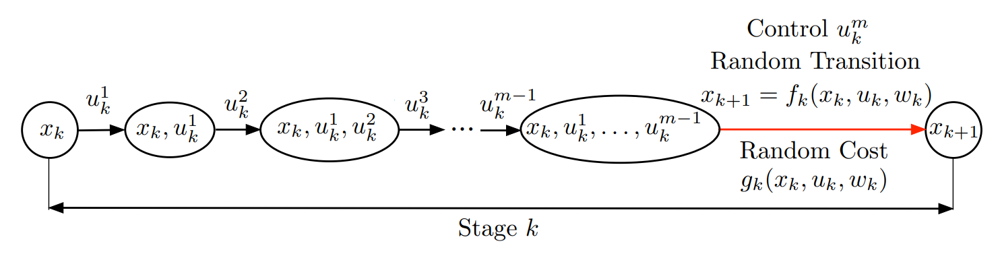
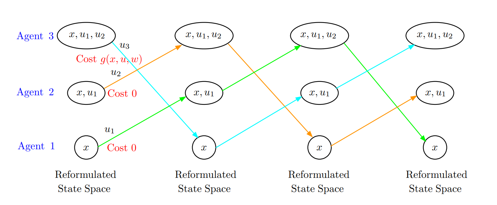

# Notes Week 11

---

### Paper: [Multiagent Rollout Algorithms and Reinforcement Learning](https://arxiv.org/pdf/1910.00120.pdf)

#### Multi-agent problem formulation - Finite Horizon Problems

Considered is a standard form of an N-stage dynamic programming (DP) problem which involves a discrete-time dynamic system

$$
\begin{equation}
    x_{k+1} = f_k(x_k, u_k, w_k), \quad \quad k = 0, 1, ..., N-1
\end{equation}
$$

where $x_k$ is an element of some (possibly infinite) state space, the control $u_k$ is an element of some finite control space, and $w_k$ is a random disturbance ($P_k(\cdot | x_k, u_k))$. Control $u_k \in U_k(x_k)$. The cost of the $k$th stage is denoted by $g_k(x_k, u_k, w_k)$. Policy is of the form $\pi = \{\mu_0, ..., \mu_{N-1}\}$, where $\mu_k$ maps states $x_k$ into controls $u_k = \mu_k (x_k)$. 

Given an initial state $x_0$ and a policy $\pi$, the expected cost of $\pi$ starting in $x_0$ is:

$$
\begin{equation}
    J_\pi(x_0) = E \left [ g_N(x_n) + \sum^{N-1}_{k=0} g_k (x_k, \mu_k(x_k), w_k) \right ]
\end{equation}
$$

where optimal cost function $J^* = J_{\pi^*} = min_{\pi \in \Pi} J$.

#### Standard rollout algorithm (Single agent)

The aim of rollout is policy improvement. Following is a standard one-step lookahead rollout algorithm:

Start with the initial state $x_0$, and proceed forward generating a trajectory $\{x_0, \tilde{u_0}, x_1, \tilde{u_1}, ..., x_{N-1}, \tilde{u_{N-1}}, x_N\}$, according to Eq 1, by applying at each state $x_k$ a control $\tilde{u_k}$ selected by the one-step lookahead minimization:

$$
\begin{equation}
    \tilde{u_k} \in \argmin_{u_k \in U_k(x_k)} E \left [ g_k(x_k, u_k, w_k) + J_{k+1, \pi} (f_k(x_k, u_k, w_k)) \right].
\end{equation}
$$

This one-step minimization, which uses $J_{k+1, \pi}$ in place of the optimal objective function, difines a policy $\tilde{\pi}$, where for all $x_k$ and $k$, $\tilde{\mu_k}(x_k)$ is equal to the control $\tilde{u_k}$ obtained from Eq 3. This pollicy is refered to as the rollout policy. The fundamental cost improvement result here is that the new policy improves over the base policy in the sense that:

$$
\begin{equation}
    J_{k, \tilde{\pi}}(x_k) \leq J_{k, \pi}(x_k), \quad \quad \forall x_k, k,
\end{equation}
$$

where $J_{k, \tilde{\pi}}(x_k), k = 0, ..., N$, is the cost-to-go of the rollout policy starting from state $x_k$.  

The expected value in Eq 3 is the Q-value of the pair $(x_k, u_k)$ corresponding to the base policy:

$$
\begin{equation}
    Q_{k, \pi}(x_k, u_k) = E \left [ g_k(x_k, u_k, w_k) + J_{k+1, \pi} (f_k (x_k, u_k, w_k)) \right]
\end{equation}
$$

In a standard rollout implementation, at each encountered state $x_k$, the Q-value is computed by some algorithm separately for each control $u_k \in U_k(x_k)$. In the case of a *Multiagent* problem, this control space can become very large. The purpose of the paper is to introduce a modified rollout algorithm for the multiagent case, which requires much less computation while maintaining the cost improvement property (Eq 4). 

#### Multiagent case

For a $m$-agent problem:
$$
    u_k = (u^1_k, ..., u^m_k)
$$

where the control constraint set is:

$$
    U_k(x_k) = U^1(x_k) \times \cdot\cdot\cdot \times U^m(x_k)
$$

#### Trading off control space complexity with state space complexity

The problem is the often exponential time consumation to perform the minimization problem with regard to $m$. To address this, the author introduces *one-agent-at-a-time control selection*. At the generic state $x_k$, we break down the control $u_k$ into the sequence of the $m$ controls $u^1_k, u^2_k, ..., u^m_k$, and between $x_k$ and the next state $x_{k+1} = f_k(x_k, u_k, w_k)$, we introduce artificial intermediate "states" $(x_k, u^1_k), (x_k, u^1_k, u^2_k), ..., (x_k, u^1_k, ..., u^{m-1}_k)$, and corresponding transitions. The last control component $u^m_k$ marks the transition to the next state $x_{k+1}$ according to the system equation, while incurring the cost $g_k(x_k, u_k, w_k)$.

In the above figure you can see the sequential control visualized. The reformulated problem is equivalent to the original problem, since any control choice that is possible in one problem is also possible in the other problem, while the cost structure of the two problems is the same. 

The reformulated problem policies:

$$
    \mu^1_k (x_k), \mu^2_k (x_k, u^1_k), ..., \mu^m_k (x_k, u_k^1, ..., u^{m-1}_k), 
$$
where $u_k^1 = \mu^1_k (x_k)$, and for $l = 2, ..., m$, $u^l_k$ is defined sequentially as:

$$
    u^l_k = \mu^l_k (x_k, u^1_k, ..., u^{l-1}_k).
$$

These reformulated policy is equivalent to the policy of the original problem:

$$
    \mu^1_k (x_k), \hat{\mu}^2_k (x_k), ..., \hat{\mu}^m_k (x_k)
$$

where for $l = 2, ..., m$, $\hat{\mu}^l_k (x_k)$ is defined sequentially as:

$$
    \hat{\mu^m_k} (x_k) = \mu^l_k(x_k, \mu^1_k (x_k), \hat{\mu}^2_k (x_k), ..., \hat{\mu}^{l-1}_k (x_k))
$$

The motivation for the reformulated problem is that the control space is simplified at the expense of introducing $m-1$ additional layers of states, and corresponding $m-1$ objective functions $J^1_k(x_k, u^1_k), J^2_k(x_k, u^1_k, u^2_k), ..., J^2_k(x_k, u^1_k, ..., u^m_k)$, in addition to $J_k(x_k)$. The increase in size of the state space does not adversely affect the operation of rollout, since the Q-value minimization is performed for just one state at each staga. Moreover, in a different context, the increase in size of the state space can be dealt with by using function approximation, i.e., with the introduction of cost-to-go approximations:

$$
    \tilde{J}^1_k(x_k, u^1_k, r^1_k), \tilde{J}^2_k(x_k, u^1_k, u_k^2, r^2_k), ..., \tilde{J}^{m-1}_k(x_k, u^1_k, u_k^2, ..., u^{m-1}_k, r^{m-1}_k),
$$

in addition to $\tilde{J}_k (x_k, r_k)$, where $r_k, r^1_k, ..., r^{m-1}_k$ are parameters of corresponding approximation architectures like neural networks.  

#### Multi-agent rollout

The algorithm generates a rollout policy $\tilde{\pi} = \{\tilde{\mu}_0, ..., \tilde{\mu}_{N-1}\}$, for each stage $k$, $\tilde{\mu}_k$ consists of $m$ components $\tilde{\mu}^l_k$, i.e., $\tilde{\mu}_k = (\tilde{\mu}^1_k, ..., \tilde{\mu}^m_k)$, and is obtained for all $x_k$ according to:

$$
\begin{align}
\begin{split}
    \tilde{\mu}^1_k (x_k) &\in \argmin_{u^1_k \in U^1_k (x_k)} E \left [ g_k(x_k, u^1_k, \mu^2_k (x_k), ..., \mu^m_k (x_k), w_k) + J_{k+1, \pi} (f_k (x_k, u^1_k, \mu^2_k (x_k), ..., \mu^m_k (x_k), w_k)) \right]\\
    \tilde{\mu}^2_k (x_k) &\in \argmin_{u^2_k \in U^2_k (x_k)} E \left [ g_k(x_k, \mu^1_k, u^2_k (x_k), ..., \mu^m_k (x_k), w_k) + J_{k+1, \pi} (f_k (x_k, \mu^1_k, u^2_k (x_k), ..., \mu^m_k (x_k), w_k)) \right]\\
    &\cdots\\
    \tilde{\mu}^2_k (x_k) &\in \argmin_{u^2_k \in U^2_k (x_k)} E \left [ g_k(x_k, \mu^1_k, u^2_k (x_k), ..., \mu^m_k (x_k), w_k) + J_{k+1, \pi} (f_k (x_k, \mu^1_k, u^2_k (x_k), ..., \mu^m_k (x_k), w_k)) \right].
\end{split}
\end{align}
$$

The algorithm generates the control $\tilde{\mu}_k (x_k)$ via a sequence of $m$ minimizations, once over each of the agent controls $u^1_k, ..., u^m_k$, with the past controls determined by the rollout policy, and the future controls determined by the base policy.

In the implementation of the algorithm, at each $(x_k, u^1_k, ..., u^{l-1}_k)$ with $l \leq m$, and for each of the controls $u^l_k$, we can estimate the Q-values, and select the control that corresponds to the maximum Q, with the controls $u^1_k, ..., u^{l-1}_k$ held fixed at the values computed earlier.

#### Rollout variants for finite horizon problems

**A.**   of selecting the agent controls in a fixed order, it is possible to change the order at each state $k$. In fact, it is possible to optimize over multiple orders at the same stage, or to base the order selection on various features of the state $x$.
**B.**  We can use at each stage $k$, a base policy $\pi = \{ \mu^1_k, ..., \mu^m_k \}$ that selects controls that depend not just on the state $x_k$, but also on the previous controls, i.e., consists of functions $\mu^l_k$ of the form $\mu_k^l(x_k, u^1_k, ..., u^{l-1}_k)$. This can exploit intuition. However, theoretically, policies where control component selection $u^l_k$ depend on previously selected control component  $u^1_k, ..., u^{l-1}_k$ in addition to the current state $x_k$, can equivalently be represented by a policy that only depends on $x_k$.
**C.**  The algorithm may be applied to partial state information problems (POMDP), after it has been transformed to a perfect state information problem, using a belief state formulation, where the conditional probability distribution of the state given the available information plays the role of $x_k$.
**D.**  We may use multi-step lookahead, truncated rollout, terminal cost function approximations.

#### Multiagent infinite horizon discounted problems

Focus here is on discounted problems with finite state space and action space $m$-agent MDP. Control $u$ consists of $m$ components $u_l, l = 1, ..., m$, $u = (u_1, ..., u_m)$.

At state $x$ and stage $k$, a control $u$ is applied, and the system transitions to a next state $y$ with transition probabilities $p_{xy}(y)$ and cost $g(x, u, y)$. When at stage $k$, the transition cost is discounted by $a^k$, where $a \in (0, 1)$ is the discount factor. Each control component $u_l$ is separately constrained to lie in a given finite set $U_l(x)$ when the system is at state x. Therefore, $U(x) = U_1(x) \times \cdots \times U_m(x)$.

The cost function for a stationary policy $\mu$ that applies contol $\mu(x) \in U(x)$ at state $x$ is denoted by $J_\mu(x)$, and the opimal costs is $J^*(x)$.

The state space of the reformulated problem consists of:

$$
    x, (x, u_1), ..., (x, u_1, ..., u_{m-1}),
$$

where $x$ ranges over the original state space, and each $u_l$, $l = 1, ..., m$, ranges over the corresponding constraint set $U_l(x)$.

#### Transforming an m-agent infinite horizon problem into a stationary infinite horizon problem with fewer control choices available at each state

Where cost is indicated as the objective function.

At each state, the agents choose their controls sequentially in a fixed order: from state $x$ agent 1 applies $u_1 \in U_1(x)$ to go to state $(x, u_1)$, then agent 2 applies $u_2 \in U_2(x)$ to go to state $(x, u_1, u_2)$, and so on for all $m$ agents, until finally at state $(x, u_1, ..., u_{m-1}$, and agent $m$ applies $u_m \in U_m(x))$, completing the choice of control $u = (u_1, ..., u_m)$, and affecting the transition to state $y$ at discounted cost $g(x, u, y)$.

This transformation involves the tradeoff between control space complexity and state space complexity. As discussed earlier in the paper, a major issue in rollout algorithms is the minimization over $u_k \in U_k(x_k)$, which may be very time-consuming when the size of the control constraint set is large. The reformulated problem involves $m$ cost-to-go functions:

$$
    J^0(x), J^1(x, u_1), ... , J^{m-1}(x, u_1, ..., u_{m-1}),
$$

with corresponding sets of Bellman equations, but a much smaller control space. 

#### Agent-by-agent policy iteration for infinite horizon discounted problems

A policy iteration algorithm generates a sequence of policies $\{\pi^k\}$, and can be viewed as repeated or perpetual rollout, i.e., $\pi^{k+1}$ is the rollout policy obtained when $\pi^k$ is the base policy. For the reformulated problem, the policy evaluation step of the algorithm requires the caluclation of $m$ $J$ functions, so the policies generated by this algorithm are also defined over a larger space and have the form:

$$
    \mu^0(x), \mu^1(x, u^1), ..., \mu^{m-1}(x, u^1, ..., u^{m-1}).
$$

One may consider an policy iteration algorithm that operates over the simpler class of policies in the form:

$$
    \mu(x) = (\mu^0(x), \mu^1(x), ... , \mu^{m-1}(x)),
$$

i.e., the policies of the original horizon problem.

The Bellman operator $T$ is introduced that maps $J = (J(1), ..., J(n))$ to the factor $TJ = (TJ(1), ..., TJ(n)):

$$
\begin{equation}
    (TJ)(x) = \min_{x \in U(x)} \sum^n_{y=1} p_{xy}(u) (g(x, u, y) + \alpha J(y)), \quad\quad\quad x = 1, ..., n 
\end{equation}
$$

where, for each policy $\mu$ this is defined as:

$$
\begin{equation}
    (T_\mu J)(x) = \sum^n_{y=1} p_{xy}(\mu(u)) (g(x, \mu(u), y) + \alpha J(y)), \quad\quad\quad x = 1, ..., n
\end{equation}
$$

#### The standard policy iteration algorithm

For each policy $\mu$, we introduce a subset of policies:

$$
    M(\mu) = {\tilde{\mu} | T_{\tilde{\mu}} J_\mu = TJ_\mu}.
$$

Equivalently, we have $\tilde{\mu} \in M(\mu)$ if $\tilde{\mu}$ is obtained from $\mu$ by using the standard policy improvement operation:

$$
    \tilde{\mu}(x) \in \argmin_{u \in U(x)} \sum^n_{y=1} p_{xy} (u) (g(x, u, y) + \alpha J_\mu (y)), \quad\quad\quad x = 1, ..., n
$$

or:

$$
    \tilde{\mu}(x) \in \argmin_{u \in U(x)} Q_\mu (x, u), \quad\quad\quad x = 1, ..., n
$$

where $Q_\mu(x, u)$ is the Q-factor of the state-control pair $(x, u)$ corresponding to $\mu$, given by:

$$
    Q_\mu(x, u) = \sum^n_{y=1} p_{xy} (u) (g(x, u, y) + \alpha J_\mu (y))
$$

---

### Paper: [Multiagent Reinforcement Learning: Rollout and Policy Iteration](https://ieeexplore-ieee-org.proxy-ub.rug.nl/stamp/stamp.jsp?tp=&arnumber=9317713)

#### Optimize agent order

First optimize over all single agent Q-values, by solving $m$ minimization problems that correspond to each of the agents $l = 1, ..., m$ being first in the multiagent order. If $l_1$ is the agent that produces the max Q-value, we fix $l_1$ to be the first agent in the multiagent order. Then we optimize over all single agent Q0values, by solving $m-1$ optimization problems that correspond to each agents $l \not l_1$ being second in the multiagent rollout order, etc.

#### Variants - Value and Policy approximations

*1) Value and policy neural network approximations*

A multiagent policy improvement operation may be performed at a sample set of states $x^s$, $s = 1, \ldots, q$, thus yielding a training set of state-rollout control pairs $(x^s, \tilde{\mu}(x^s))$, which can be used to train a policy neural network to generate an approximation $\hat{\mu}$ to the policy $\tilde{\mu}$ (rollout policy). The $\hat{\mu}$ becomes the new base policy and can be used in turn to train a value network that approximates its cost function value $J_{\hat{\mu}}$. Note that the training of the agent policies $\hat{\mu}_1, \ldots , \hat{\mu}_m$ may be done separately for each agent, with $m$ separate neural networks. 

Using this, the potentially large action space problem is overcome using one-agent-at-a-time policy improvement, while the difficulty with potentially large state space is overcome by using neural networks.

*3) Policy iteration and Q-learning*

---

#### Generalized Policy Iteration

Used to find $\pi^*$, by letting policy evaluation and improvement interact.