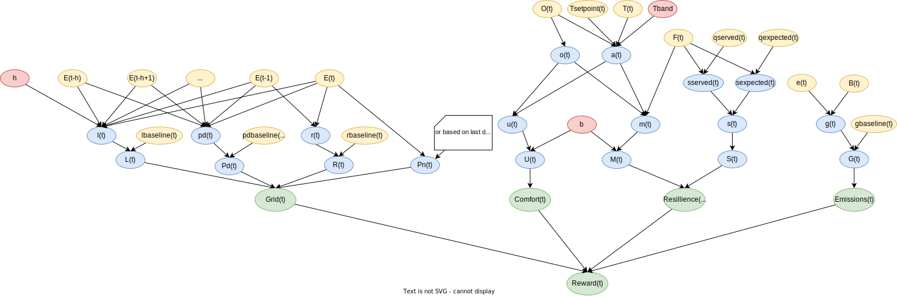

# Notes Week 47

---

### Dependence Diagram:
A dependency graph is a data structure formed by a directed graph that describes the dependency of an entity in the system on the other entities of the same system. The underlying structure of a dependency graph is a directed graph where each node points to the node on which it depends.

In our project we will be looking at the score/reward function variable interdependence. 



The Grid key performance indicator (KPI) is calculated using neighborhood level observations. All other KPIs are building-wise additive calculations. The Comfort and Resilience KPIs have a lot of variables in common as the unmet hours(U) and  are the same except for the power outage boolean. Meaning: The grid resilience score is calculated as the thermal comfort indicator during a power outage.

DISTRICT WISE ELEC CONSUMPTION = ADDITIVE NET ELEC BUILDING?

---

### Observations used in reward calculation (personally estimated based on reward function):

Other variables not used directly in score/reward calculation can possibly be used in prediction of various things, for example: warming/cooling energy loads based on outdoor dry bulb temperature.

##### Dynamics independent variables:
1. Neigborhood level variables:
   - Calendar type variables: 
     - [x] Month
     - [x] Hour
     - [x] Day type
     - [ ] Daylight saving status
   - Weather type variables: 
     - [ ] Outdoor dry bulb temp (0h)
     - [ ] Outdoor dry bulb temp (6h, 12h, 24h)
     - [ ] Outdoor relative humidity (0h, 6h, 12h, 24h)
     - [ ] Diffuse solar irradiance (0h, 6h, 12h, 24h)
     - [ ] Direct solar irradiance (0h, 6h, 12h, 24h)
   - [x] District level carbon intensity (district = neighborhood)

2. Building specific variables:
   - [x] Average unmet cooling setpoint difference
   - [x] Indoor relative humidity
   - [x] Non shiftable load
   - [x] Solar generation
   - [ ] Electricity pricing (0h, 6h, 12h, 24h)
   - [x] Indoor dry bulb temperature set point

##### Dynamics dependent variables:
1. Neighborhood level variables:
   - None
2. Building specific variables:
   - [x] Cooling storage state of charge
   - [x] Heating storage state of charge
   - [x] Domestic hot water storage state of charge
   - [x] Electrical storage state of charge
   - [x] Net electricity consumption
   - [x] Cooling device coefficient of performance
   - [x] Heating device coefficient of performance
   - [x] Cooling electricity consumption
   - [x] Heating electricity consumption
   - [x] Domestic hot water electricty consumption

##### Either taken from .csv file or calculated during runtime:
1. Neighborhood level variables:
   - None
2. Building level variables:
   - [x] Indoor dry bulb temperature
   - [x] Cooling demand
   - [x] Heating demand
   - [x] Domestic hot water demand
   - [x] Indoor dry bulb temperature difference to set point
   - [x] Power outage boolean (?) 

---

### Paper: [Exploiting Separability in Multiagent Planning with Continuous-State MDPs](https://lis.csail.mit.edu/pubs/amato-aamas14.pdf)
**ABSTRACT:** Recent years have seen significant advances in techniques for optimally solving multiagent problems represented as decentralized partially observable Markov decision processes (Dec-POMDPs). A new method achieves scalability gains by converting Dec-POMDPs into continuous state MDPs. This method relies on the assumption of a centralized planning phase that generates a set of decentralized policies for the agents to execute. However, scalability remains limited when the number of agents or problem variables becomes large. In this paper, we show that, under certain separability conditions of the optimal value function, the scalability of this approach can increase considerably. This separability is present when there is locality of interaction,  which — as other approaches (such as those based on the ND-POMDP subclass) have already shown — can be exploited to improve performance. Unlike most previous methods, the novel continuous-state MDP algorithm retains optimality and convergence guarantees. Results show that the extension using separability can scale to a large number of agents and domain variables while maintaining optimality.

<!-- ##### Main takeaways:
- A new method achieves scalability gains by converting decentralized partially observable Markov decision processes (Dec-POMDPs) into continuous state MDPs.
- The paper shows that, under certain separability conditions of the optimal value function, the scalability of this approach can increase significantly.
- The separability is based on locality of interaction which can be exploited to improve performance.
- This novel approach retains optimality and convergence guarantees, unlike most previous methods.
- Scalability is mentioned in form of number of agents and domain variables.
 -->

### Summary:

#### Introduction

- Decentralized partially observable markov decision processes (**Dec-POMDPs**)
- multiagent Markov decision processes (**MMDPs**)
- Network distributed partially observable MDPs (**ND-POMDPs**)
- Dec-POMPs are **NEXP-hard**.
  - NEXP-hard = nondeterministic exponential time
- **Separability conditions** can occur when optimal value functions are the sum of linear functions over factors associated with a small subset of problem variables. These value functions are known as additive weakly-separable linear functions (**AWSL**). 
- **Target domain** is ND-POMDPs (subclass of Dec-POMDPs).
- **[Recent method](https://jair.org/index.php/jair/article/view/10986)** demonstrated a scalability increase on general Dec-POMDPs by recasting them as continuous-state and deterministic MDPs. 
  - This 
- The paper **combines** the **transforming of Dec-POMDPs into continuous-state MDPs** and the **locality of interaction found in ND-POMDPs**.
- It is demonstrated that, with the locality of interaction, optimal value functions are **AWSL functions of occupancy states**. Also, **it is proven that AWSL functions depend on occupancy states only through marginal probability distributions over factors**.

<!-- ###### Dec-POMDPs conversion into continuous-state MDPs -->
#### Dec-POMDPs

JOINTLY FULLY OBSERVABLE

A Dec-POMDP with $N$ agents is given by:
$$
   \mathcal{P} \equiv (S, A, Z, p, r, \eta_0, T)
$$

- A finite set of states $S$.
- A finite set of actions; an action set $A_i$ for agent $i$:

$$
   A = A_1 \times A_2 \times ... \times A_N
$$

- A finite set of joint observations; an observation set $Z_i$ for agent $i$:
  
$$
   Z = Z_1 \times Z_2 \times ... \times Z_N
$$

- A system dynamics model; state-to-state transition matrices $p^{a, z}$, where $p^{a, z}(s, s')$ describes the probability of transitioning to state $s'$, upon receiving joint observation $z$ and after taking joint action $a$ in state $s$:
  
$$
   p = \{p^{a, z}: a \in A, z \in Z\}
$$

- A reward model:
  
$$
   r = \{ r^a : a \in A \},
$$
where $r^a$ is a reward vector and $r^a(s)$ is the immediate reward to be gained by executing joint action $a$ in state $s$.

- An initial probability distribution $\eta_0$ over states.
- A planning horizon $T$.

In this model each agent receives its own observations but it receives neither observations nor actions of the other agents. The core of the high complexity of Dec-POMDPs is that each agent has to reason about what the others have observed and are planning to do. This problem results in $N$ local policies, which jointly maximize the total expected stream of rewards starting from $\eta_0$. Each local policy only depends upon only the local information of that agent. 

#### ND-POMDP:

An ND-POMDP is a Dec-POMDP that exhibits:

- A **factored state space**: local states $S_0$ which cannot be affected by other agents, and a local state state-set $S_i$ per agent. 
- A **multiplicative weakly-separable dynamics model** p, that is, there exists dynamics models $p_0, p_1, ... , p_N$ such that:
  
   $$
      p_u^{a_u. z_u}(s_u, s'_u) = p_0(s_0, s'_0) \prod_{i\in u}p_i^{a_i, z_i} (s_i, s_0, s'_i) 
   $$
   for any factor of state spaces, and any subset of agent state spaces.

- An **additive weakly-separable reward model** r, that is, there exists reward models $r_{u_{1}}, r_{u_{2}}, ... , r_{u_{M}}$, such that:

   $$
      r(s,a) = \sum^{M}_{k=1} r_{u_k}(s_{u_k}, a_{u_k}),
   $$
   where $s_{u_k}$ is a factored subset of all agent state spaces. This basically means that there exist a optimal additive reward function as the sum of reward achieved per agent.

- A **multiplicative fully-separable distribution** $n^0$, that is, there exists independent distributions $n^0_0, n^1_0, ... , n^N_0$ such that:

   $$
      n^0(s) = n_0^0(s_0)\prod^N_{i=1}n_i^0(s_i)
   $$
   
<span style="color:red">An ND-POMDPs interacts only with a small subset of their neighbors</span>, unlike Dec-POMDPs. 

To summarize: ND-POMDPs are MDPs where locality of interaction is present: a network of agents is formed based on each agent's limited interactions with a small number of neighbors [[Nair et al.](https://cdn.aaai.org/AAAI/2005/AAAI05-022.pdf)].

#### Policies and Value Functions 

The local policy of an agent at timestep $t$ is defined as a decision rule $d_i^t$, which is a mapping from $t$-step action and observation histories of agent $i$. **In some restricted settings the decision rules depend on current state features only, rather than histories.** This is in cases where agents can directly observe these state features.

A joint policy is the tuple of local agent policies and decision rules.

In the paper, finite-horizon Dec-POMDPs are considered. The optimal joint value function, that maps state and joint history pairs, is pointed out to be linear over some high-dimensional space.

#### Dec-POMDPs as Continuous-State MDPs

Common assumption: planning is centralized while execution is decentralized. The centralized controller posseses over the information state for that time step. The information state is all the information the centralized controller has about the process.

This information state is a sequence ($\eta^0, d^0, ..., d^{t-1}$) of past joint decision rules starting with the initial distribution. A centralized algorithm selects the joint decision rule for the agents to execute in the current time-step. 

When we take information state set $I$ along with the joint decision rule set $D$, next step information set $F$, the immediate expected reward to be gained by executing a joint decision rule in the current information state $R$, and the starting information state $\iota^0$ we can create a **deterministic MDP** $\mathcal{P'}$ with respect to the original MDP $\mathcal{P}$. When constructing $\mathcal{P'}$ we use the transition, observation and reward function of the original MDP.

A computation of the entire multivariate probability distribution $P(s, \theta|\iota^t)$, where $\theta$ is the joint observation action history, needs to be done at each time-step. This is called the **occupancy state** $\eta^t$. Here, the next step occupancy state depends on the current occupancy state and the joint decision rule for the current state. 

The **occupancy markov decision process** is the MDP $\mathcal{P''}$ with respect to the deterministic MDP $\mathcal{P'}$, which consists of the history of occupancy states instead of the information state set.

This in turn is a **deterministic continuous-state MDP**. The optimal joint policy for $\mathcal{P''}$, together with the correct estimation of occupancy states, will give the optimal policy for $\mathcal{P'}$ and $\mathcal{P}$.

Basically: 
- **POMDPS** $\mathcal{P}$
- **Deterministic MDPs** $\mathcal{P'}$ (with set of information states)
- **Occupancy state** (set of probability distributions over all states and joint histories) (t-step sufficient statistic with respect to the current information state)
- **deterministic continuous-state MDPs** $\mathcal{P''}$ (with set of occupancy states) (occupancy MDPs)

#### Solving Occupancy MDPs
POMDPs cast into occupancy MDPs have piecewise linear convex optimal value functions. Dibangoye et al. proved that value functions which are solutions of the optimality equations (based on decision rules that maximizes expected reward through the reward and transition function) are **piecewise-linear and convex functions** of the occupancy states. This means that there exists a finite set of linear functions $\Lambda^0, ... , \Lambda^(T-1)$ such that: $v_*^ t = max_{\alpha^t \in \Lambda^t}\langle \alpha^t, \eta^t \rangle $ for any arbitrary t-step occupancy state $\eta^t$.

#### Leveraging Seperability
Value function is the sum of linear functions over factors. Also called: additive weak separability and linearity. 

The idea is that additive fully separable objective functions optimization can be reduced to independent optimization problems with lower dimensionalities. However, often it is not fully separable. The authors show weak separability can be exploited. The authors show that optimal value functions are additive **weakly-separable linear functions** (AWSL) of the occupancy states.  

The theorem demonstrates that value functions can be represented using a finite set of low-dimensional vectors for each joint history. 

---

### Paper: [Optimally Solving Dec-POMDPs as Continuous-State MDPs](https://jair.org/index.php/jair/article/view/10986/26136)

**ABSTRACT:** Decentralized partially observable Markov decision processes (Dec-POMDPs) provide a gen-eral model for decision-making under uncertainty in decentralized settings, but are difficult to solveoptimally (NEXP-Complete). As a new way of solving these problems, we introduce the idea oftransforming a Dec-POMDP into a continuous-state deterministic MDP with a piecewise-linear andconvex value function. This approach makes use of the fact that planning can be accomplished in acentralized offline manner, while execution can still be decentralized. This new Dec-POMDP for-mulation, which we call anoccupancy MDP, allows powerful POMDP and continuous-state MDPmethods to be used for the first time. To provide scalability,we refine this approach by combin-ing heuristic search and compact representations that exploit the structure present in multi-agentdomains, without losing the ability to converge to an optimal solution. In particular, we introducea feature-based heuristic search value iteration (FB-HSVI) algorithm that relies on feature-basedcompact representations, point-based updates and efficient action selection. A theoretical analysisdemonstrates that FB-HSVI terminates in finite time with an optimal solution. We include an ex-tensive empirical analysis using well-known benchmarks, thereby demonstrating that our approachprovides significant scalability improvements compared tothe state of the art.

#### Summary:
##### Introduction:

Dec-POMDPs is the target domain, where multiple agents have to coordinate their actions in order to achieve common long-term goals while uncertainty is present in the effects of their actions and the information received by the agents (ex. noisy data, incomplete data). 

*The decentralized partially observable Markov decision process (Dec-POMDP) is a standardformulation for cooperative decision-making in these sequential settings without instantaneous, freeand noiseless communication*

<!-- *In the CityLearn environment * -->

---

### (Partial) Observability of the CityLearn 2023 environment

It is stated that in the decentralized-coordinated setting information has to be shared amongst agents. 

*CityLearn supports centralized, decentralized-independent and decentralized-coordinated control architectures. In the centralized architecture, 1 agent controls all storage, cooling and heating devices i.e. provides as many actions as storage, cooling and heating devices in the district. In the decentralized-independent architecture, each building has it’s own unique agent and building agents do not share information i.e. each agent acts in isolation and provides as many actions as storage, cooling and heating devices in the building it controls. The decentralized-coordinated architecture is similar to the decentralized-independent architecture with the exception of information sharing amongst agents.*

One example decentralized-coordinated control algorithm dubbed **MARLISA** has been made available. When looking into the source code we can see that the joint observation of all agents is passed into a policy_net, which returns the joint actions of the agents. 

```
    def get_post_exploration_prediction_with_information_sharing(self, observations: List[List[float]], deterministic: bool) -> Tuple[List[List[float]], List[List[float]]]:
        agent_count = len(self.action_dimension)
        actions = [None for _ in range(agent_count)]
        action_order = list(range(agent_count))
        next_agent_ixs = [sorted(action_order)[action_order[(i + 1)%agent_count]] for i in range(agent_count)]
        coordination_variables = [[0.0, 0.0] for _ in range(agent_count)] 
        expected_demand = [0.0 for _ in range(agent_count)]
        total_demand = 0.0
        
        for i in range(self.iterations):
            capacity_dispatched = 0.0

            for c, n, o, o_ in zip(action_order, next_agent_ixs, observations, observations):
                o = self.get_encoded_observations(c, o)
                o = np.hstack(np.concatenate((o, coordination_variables[c])))
                o = self.get_normalized_observations(c, o)
                o = self.pca[c].transform(o.reshape(1,-1))[0]
                o = torch.FloatTensor(o).unsqueeze(0).to(self.device)
                result = self.policy_net[i].sample(o)
                a = result[2] if deterministic else result[0]
                a = list(a.detach().cpu().numpy()[0])
                actions[c] = a
                expected_demand[c] = self.predict_demand(c, o_, a)

                if i == self.iterations - 1 and c == action_order[-1]:
                    pass
                else:
                    total_demand += expected_demand[c] - expected_demand[n]
                    coordination_variables[n][0] = total_demand/self.total_coefficient

                coordination_variables[c][1] = capacity_dispatched
                capacity_dispatched += self.energy_size_coefficient[c]
        
        return actions, coordination_variables
```

This leads back to a **PolicyNetwork** class of the **citylearn.rl** module which contains a couple of dense layers. The action space and the number of actions can be specified as one likes. In the MARLISA example they use the action space of one agent, and therefore the code above is executed using all environment data excluding other agent's actions.

```
class PolicyNetwork(nn.Module):
    def __init__(self, 
                 num_inputs, 
                 num_actions, 
                 action_space, 
                 action_scaling_coef, 
                 hidden_dim = [400,300],
                 init_w = 3e-3, 
                 log_std_min = -20, 
                 log_std_max = 2, 
                 epsilon = 1e-6):
```
