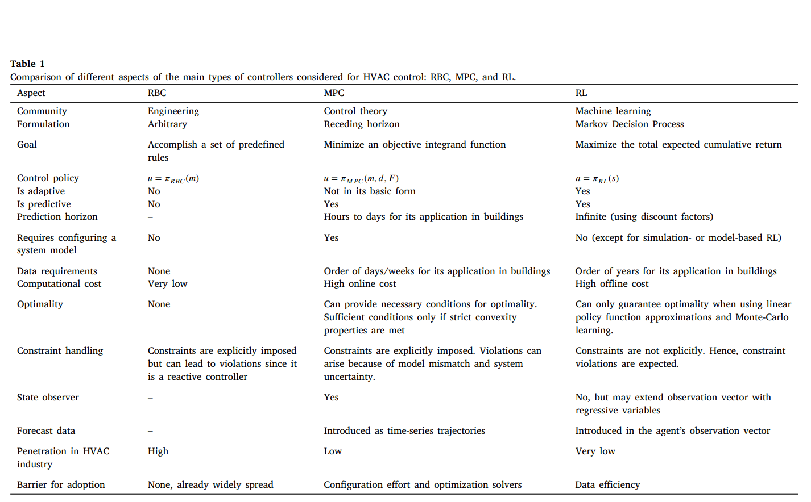

# Notes Week 52
---

### Observations to use in Reward calculation

**Given in citylearn challenge 2023:**

{'day_type': 5,
 'hour': 1,
 'outdoor_dry_bulb_temperature': 24.66,
 'outdoor_dry_bulb_temperature_predicted_6h': 24.910639,
 'outdoor_dry_bulb_temperature_predicted_12h': 38.41596,
 'outdoor_dry_bulb_temperature_predicted_24h': 27.611464,
 'diffuse_solar_irradiance': 0.0,
 'diffuse_solar_irradiance_predicted_6h': 54.625927,
 'diffuse_solar_irradiance_predicted_12h': 116.84289,
 'diffuse_solar_irradiance_predicted_24h': 0.0,
 'direct_solar_irradiance': 0.0,
 'direct_solar_irradiance_predicted_6h': 143.32434,
 'direct_solar_irradiance_predicted_12h': 1020.7561,
 'direct_solar_irradiance_predicted_24h': 0.0,
 'carbon_intensity': 0.40248835,
 'indoor_dry_bulb_temperature': 23.098652,
 'non_shiftable_load': 0.35683933,
 'solar_generation': 0.0,
 'dhw_storage_soc': 0.0,
 'electrical_storage_soc': 0.2,
 'net_electricity_consumption': 0.67788136,
 'electricity_pricing': 0.02893,
 'electricity_pricing_predicted_6h': 0.02893,
 'electricity_pricing_predicted_12h': 0.02915,
 'electricity_pricing_predicted_24h': 0.02893,
 'cooling_demand': 1.1192156,
 'dhw_demand': 0.055682074,
 'occupant_count': 3.0,
 'indoor_dry_bulb_temperature_set_point': 23.222221,
 'power_outage': 0}

 **All possible observations for citylearn environment:**

 {'month': 6,
 'hour': 1,
 'day_type': 5,
 'daylight_savings_status': 0,
 'indoor_dry_bulb_temperature': 23.098652,
 'average_unmet_cooling_setpoint_difference': -0.1235699,
 'indoor_relative_humidity': 61.086185,
 'non_shiftable_load': 0.35683933,
 'dhw_demand': 0.055682074,
 'cooling_demand': 1.1192156,
 'heating_demand': 0.0,
 'solar_generation': 0.0,
 'occupant_count': 3.0,
 'indoor_dry_bulb_temperature_set_point': 23.222221,
 'power_outage': 0,
 'indoor_dry_bulb_temperature_without_control': 23.098652,
 'cooling_demand_without_control': 1.1192156,
 'heating_demand_without_control': 0.0,
 'dhw_demand_without_control': 0.055682074,
 'non_shiftable_load_without_control': 0.35683933,
 'indoor_relative_humidity_without_control': 61.086185,
 'indoor_dry_bulb_temperature_set_point_without_control': 23.222221,
 'hvac_mode': 1,
 'outdoor_dry_bulb_temperature': 24.66,
 'outdoor_relative_humidity': 77.56,
 'diffuse_solar_irradiance': 0.0,
 'direct_solar_irradiance': 0.0,
 'outdoor_dry_bulb_temperature_predicted_6h': 24.910639,
 'outdoor_dry_bulb_temperature_predicted_12h': 38.41596,
 'outdoor_dry_bulb_temperature_predicted_24h': 27.611464,
 'outdoor_relative_humidity_predicted_6h': 72.98027,
 'outdoor_relative_humidity_predicted_12h': 41.82236,
 'outdoor_relative_humidity_predicted_24h': 83.230995,
 'diffuse_solar_irradiance_predicted_6h': 54.625927,
 'diffuse_solar_irradiance_predicted_12h': 116.84289,
 'diffuse_solar_irradiance_predicted_24h': 0.0,
 'direct_solar_irradiance_predicted_6h': 143.32434,
 'direct_solar_irradiance_predicted_12h': 1020.7561,
 'direct_solar_irradiance_predicted_24h': 0.0,
 'electricity_pricing': 0.02893,
 'electricity_pricing_predicted_6h': 0.02893,
 'electricity_pricing_predicted_12h': 0.02915,
 'electricity_pricing_predicted_24h': 0.02893,
 'carbon_intensity': 0.40248835,
 'cooling_storage_soc': 0.0,
 'heating_storage_soc': 0.0,
 'dhw_storage_soc': 0.0,
 'electrical_storage_soc': 0.2,
 'net_electricity_consumption': 0.67788136,
 'cooling_electricity_consumption': 0.26175198,
 'heating_electricity_consumption': 0.0,
 'dhw_electricity_consumption': 0.059290096,
 'cooling_storage_electricity_consumption': 0.0,
 'heating_storage_electricity_consumption': 0.0,
 'dhw_storage_electricity_consumption': 0.0,
 'electrical_storage_electricity_consumption': 0.0,
 'cooling_device_cop': array(4.27586316),
 'heating_device_cop': array(3.12831856),
 'indoor_dry_bulb_temperature_delta': 0.12356949}

 **Difference:**

 'daylight_savings_status': 0,
 'average_unmet_cooling_setpoint_difference': -0.1235699,
 'cooling_demand_without_control': 1.1192156,
 'heating_demand_without_control': 0.0,
 'dhw_demand_without_control': 0.055682074,
 'non_shiftable_load_without_control': 0.35683933,
 'indoor_relative_humidity_without_control': 61.086185,
 'indoor_dry_bulb_temperature_set_point_without_control': 23.222221,
 'hvac_mode': 1,
 'cooling_storage_electricity_consumption': 0.0,
 'heating_storage_electricity_consumption': 0.0,
 'dhw_storage_electricity_consumption': 0.0,
 'electrical_storage_electricity_consumption': 0.0,
 'indoor_dry_bulb_temperature_delta': 0.12356949
 'indoor_relative_humidity': 61.086185,
 'outdoor_relative_humidity_predicted_6h': 72.98027,
 'outdoor_relative_humidity_predicted_12h': 41.82236,
 'outdoor_relative_humidity_predicted_24h': 83.230995,

---

### First results

#### Using the energy reward function given in by the challenge

20 epoch/ 500 epoch: 

name	|Building_1	|Building_2|	Building_3|	District|
-------|----------|------------|------------|-----------|
cost_function				
annual_normalized_unserved_energy_total	|0.040994|	0.031383|	0.016687|	0.029688
||	0.047288|	0.068959|	0.037210|	0.051152 
annual_peak_average	|NaN|	NaN|	NaN|	0.916526
||NaN|	NaN|	NaN|	0.642677
carbon_emissions_total|	0.664530|	0.950685|	0.768076|	0.794430
||	0.375099|	0.424919|	0.485740|	0.428586
cost_total|	0.621010	|0.941299	|0.736163|	0.766157
||	0.356556|	0.412925|	0.465554|	0.411678
daily_one_minus_load_factor_average	|NaN|	NaN|	NaN|	1.148110
||	NaN|	NaN|	NaN|	1.205944
daily_peak_average|	NaN|	NaN|	NaN|	0.977748
||NaN|	NaN|	NaN|	0.610686
discomfort_delta_average	|1.664222	|0.106197|	0.715239|	0.828553
||9.206611	|6.959458|	7.833532|	7.999867!!!
discomfort_delta_maximum|	10.693090|	7.757879|	7.290037|	8.580336
||	16.692406|	14.765867|	13.961416|	15.139896
discomfort_delta_minimum|	-8.249487	|-9.666939|	-4.148111|	-7.354846
||	-0.123569|	-0.581318|	-0.372210|	-0.359032
discomfort_proportion|	0.572230|	0.533582|	0.409318|	0.505043
||	0.980365|	0.977612|	0.978369|	0.978782
discomfort_too_cold_proportion|	0.110799|	0.251866	|0.099834|	0.154166
||	0.000000|	0.000000|	0.000000|	0.000000
discomfort_too_hot_proportion|	0.461431|	0.281716|	0.309484|	0.350877
||	0.980365|	0.977612|	0.978369|	0.978782!!!
electricity_consumption_total	|0.670024|	0.953164|	0.778043|	0.800410
||	0.377034	|0.426918|	0.488286	| 0.430746
monthly_one_minus_load_factor_average|	NaN	|NaN|	NaN|	1.047417
||	NaN|	NaN|	NaN|	1.094343
one_minus_thermal_resilience_proportion|	0.333333|	0.785714|	0.266667|	0.461905
||	0.933333|	1.000000|	1.000000	| 0.977778!!!
power_outage_normalized_unserved_energy_total|	0.760572|	0.843412|	0.595447|	0.733144
||	0.651892	|0.737790|	0.679437|	0.689706
ramping_average|	NaN|	NaN|	NaN|	1.357430
||	NaN|	NaN|	NaN|	0.736733
zero_net_energy|	0.575715|	0.902347|	0.747688|	0.741916
||	0.279682|	0.369444	|0.456251|	0.368459

---

## Paper: [Ten questions concerning reinforcement learning for building energy management](https://www.sciencedirect.com/science/article/pii/S0360132323004626)

ABSTRACT: As buildings account for approximately 40% of global energy consumption and associated greenhouse gas emissions, their role in decarbonizing the power grid is crucial. The increased integration of variable energy sources, such as renewables, introduces uncertainties and unprecedented flexibilities, necessitating buildings to adapt their energy demand to enhance grid resiliency. Consequently, buildings must transition from passive energy consumers to active grid assets, providing demand flexibility and energy elasticity while maintaining occupant comfort and health. This fundamental shift demands advanced optimal control methods to manage escalating energy demand and avert power outages. Reinforcement learning (RL) emerges as a promising method to address these challenges. In this paper, we explore ten questions related to the application of RL in buildings, specifically targeting flexible energy management. We consider the growing availability of data, advancements in machine learning algorithms, open-source tools, and the practical deployment aspects associated with software and hardware requirements. Our objective is to deliver a comprehensive introduction to RL, present an overview of existing research and accomplishments, underscore the challenges and opportunities, and propose potential future research directions to expedite the adoption of RL for building energy management.

### Main takeaways:

### Summary:

#### Introduction

Out of building energy use, over 40% is spend on maintaining thermal comfort, particularly by heating, ventilating and air-conditioning (HVAC) systems. Also, humans spend 86% of their life indoors. Increasingly, building control systems are expected to consider additional goals like flexibility, carbon emissions, and managing onsite renewable energy production and storage. Additionaly, human occupancy can be more actively considered in these systems.

10 questions are discussed in the paper. Question 1-4 serve as a general introduction and background to RL. Question 5-8 adress practical questions for RL in buildings. Question 9-10 address the challenges and future opportunities.

#### Questions
<u>*Q1: What is reinforcement learning and what is its promise in buildings?*</u>

Conventional rule based systems are based on expert experience and greatly lack adaptability. Additionally, they are reactive and do not take into account forecasts.

MPC requires the development of control models which capture the dynamic behavior of the building and its HVAC systems, of which every building is unique, requiring extensive research to develop and maintain an accurate control model for each building.

<u>*Q2: how is RL related to other control theory methods?*</u>

Here, a comparison is made between RBC, MPC, RLC. Table:

<u>*Q3: What are different types of RL algorithms and what are their advantages and disadvantages?*</u>
- Value based
- Actor-critic
- Policy gradient